# Decision Engine -- Neural Flowchart

```mermaid
flowchart TD
    %% ============================================================
    %% PHASE 1: CATEGORY CLASSIFICATION
    %% ============================================================
    subgraph P1["Phase 1: Category Classification"]
        direction TB
        START([User provides business description]) --> Q1
        Q1{{"T1: Is this a restaurant/cafe/bar?"}}
        Q1 -- yes --> CAT_REST[restaurant]
        Q1 -- no --> Q2
        Q1 -- idk --> Q2

        Q2{{"T1: Is this software/app/digital?"}}
        Q2 -- yes --> CAT_SAAS[saas_product]
        Q2 -- no --> Q3
        Q2 -- idk --> Q3

        Q3{{"T1: Is this a professional service?"}}
        Q3 -- yes --> CAT_SVC[service_business]
        Q3 -- no --> ESC1
        Q3 -- idk --> ESC1

        ESC1{{"T2: Which category fits best?"}}
        ESC1 -- classified --> CAT_OUT[Category determined]
        ESC1 -- idk --> USER_CAT[Ask user to choose category]
        USER_CAT --> CAT_OUT
    end

    CAT_REST --> CAT_OUT
    CAT_SAAS --> CAT_OUT

    %% ============================================================
    %% PHASE 2A: COMPETITOR + USER SITE ANALYSIS (automatic)
    %% ============================================================
    CAT_OUT --> P2A

    subgraph P2A["Phase 2A: Site Analysis (parallel, background)"]
        direction TB
        SCRAPE["Scrape competitor sites<br/>+ user's existing site"] --> STRUCT
        STRUCT["T1: 10 structure questions<br/>per site (parallel)"] --> TASTE_Q
        TASTE_Q["T1: 8 taste questions<br/>per site (parallel)"] --> DERIVE

        DERIVE["Derive: competitor profiles,<br/>industry norm, gaps, crowded patterns"]
    end

    %% ============================================================
    %% PHASE 2B: USER VISUAL CHOICES (interactive)
    %% ============================================================
    CAT_OUT --> P2B

    subgraph P2B["Phase 2B: User Taste Profiling (interactive)"]
        direction TB
        VIBE["Vibe comparison<br/>(3 mini-previews, T2-generated)"]
        VIBE --> VIBE_CLASS["T1: Classify chosen vs rejected<br/>(formal? colorful? spacious? warm?)"]
        VIBE_CLASS --> UPDATE1["Update taste_profile"]

        UPDATE1 --> COLOR["Color palette choice<br/>(3 palettes, filtered)"]
        COLOR --> COLOR_CLASS["T1: warm-toned? high-contrast?"]
        COLOR_CLASS --> UPDATE2["Update taste_profile"]

        UPDATE2 --> FONT["Font pairing choice<br/>(3 pairings, filtered)"]
        FONT --> FONT_CLASS["T1: formal? decorative?"]
        FONT_CLASS --> UPDATE3["Update taste_profile"]

        UPDATE3 --> LAYOUT["Layout choice<br/>(2 wireframes)"]
        LAYOUT --> LAYOUT_CLASS["T1: dense? conventional?"]
        LAYOUT_CLASS --> UPDATE4["Update taste_profile"]
    end

    %% ============================================================
    %% MERGE: Combine signals
    %% ============================================================
    P2A --> MERGE
    P2B --> MERGE
    MERGE["Merge: user choices + competitor<br/>profiles + user site delta<br/>= final taste_profile"]

    %% ============================================================
    %% PARAMETER ADAPTATION
    %% ============================================================
    MERGE --> PARAMS

    subgraph PARAMS["Parameter Adaptation"]
        direction LR
        TP["taste_profile"] --> AI_TEMP["ai_temp = 0.15 + creativity * 0.4"]
        TP --> VP["variant_pool = 2 + creativity * 4"]
        TP --> CT["constraint = 1.0 - creativity * 0.5"]
        TP --> BR["border_radius = warmth * 16px"]
        TP --> CTEMP["content_temp = 0.10 + creativity * 0.5 + boldness * 0.1"]
    end

    %% ============================================================
    %% PHASE 3: BLOCK SELECTION & CONTENT (AI-driven)
    %% ============================================================
    PARAMS --> P3

    subgraph P3["Phase 3: Block Selection & Content"]
        direction TB
        INCL["T1: Include optional block?<br/>(per block, 2 questions each)"]
        INCL --> INCL_LOGIC{"Both yes? First yes+second no?<br/>First no? Any idk?"}
        INCL_LOGIC -- include --> VAR
        INCL_LOGIC -- exclude --> SKIP["Skip block"]

        VAR["T1: Select variant per block<br/>(filter by tag match, then classify)"]
        VAR --> ORDER

        ORDER{"constraint > 0.7?"}
        ORDER -- yes --> STRICT["Use category assembly order"]
        ORDER -- no --> FLEX["T2: Suggest reordering"]

        STRICT --> CONTENT
        FLEX --> CONTENT

        CONTENT["T2: Generate content<br/>(headlines, CTAs, meta, copy)<br/>temp = adapted from taste_profile"]
    end

    %% ============================================================
    %% PHASE 4: PREVIEW & APPROVAL
    %% ============================================================
    P3 --> P4

    subgraph P4["Phase 4: Preview & Approval"]
        direction TB
        ASSEMBLE["Assemble page spec YAML<br/>(blocks + variants + content + skin)"]
        ASSEMBLE --> RENDER["BlockRenderer: YAML -> HTML"]
        RENDER --> INTEL["Show competitive intelligence:<br/>- missing blocks vs competitors<br/>- taste shift from old site<br/>- unique differentiators"]
        INTEL --> APPROVE{"User approves?"}
        APPROVE -- "Looks great" --> DONE([Generate final site])
        APPROVE -- "Try different colors" --> COLOR
        APPROVE -- "Try different layout" --> LAYOUT
        APPROVE -- "Change text" --> CONTENT
        APPROVE -- "Start over" --> START
    end

    %% ============================================================
    %% TIER LEGEND
    %% ============================================================
    subgraph LEGEND["Tier Legend"]
        direction LR
        T1L["T1 = qwen3.5:2b<br/>temp 0, yes/no/idk<br/>~100ms, ~1.5GB VRAM"]
        T2L["T2 = qwen3.5:9b<br/>adaptive temp<br/>~2-8s, ~6.6GB VRAM"]
    end

    %% ============================================================
    %% IDK ESCALATION (shown as note)
    %% ============================================================
    subgraph ESC["idk Escalation Chain"]
        direction LR
        IDK1["1. Rephrase + retry T1"] --> IDK2["2. Escalate to T2"]
        IDK2 --> IDK3["3. Fall back to category default"]
    end

    %% Styling
    classDef tier1 fill:#dbeafe,stroke:#2563eb,color:#1e3a5f
    classDef tier2 fill:#fce7f3,stroke:#db2777,color:#831843
    classDef user fill:#dcfce7,stroke:#16a34a,color:#14532d
    classDef derive fill:#fef3c7,stroke:#d97706,color:#78350f

    class Q1,Q2,Q3,STRUCT,TASTE_Q,VIBE_CLASS,COLOR_CLASS,FONT_CLASS,LAYOUT_CLASS,INCL,VAR tier1
    class ESC1,CONTENT,FLEX tier2
    class VIBE,COLOR,FONT,LAYOUT,USER_CAT,APPROVE user
    class DERIVE,MERGE,INCL_LOGIC,ORDER derive
```

## Call Budget Summary

| Phase | Tier 1 Calls | Tier 2 Calls | Notes |
|-------|-------------|-------------|-------|
| 1: Classification | 3 | 0-1 | T2 only if T1 can't classify |
| 2A: Competitor analysis | 36 | 0 | 18 per competitor, parallelizable |
| 2A: User site analysis | 0-18 | 0 | Only if user has existing site |
| 2B: User choices | 8-12 | 1 | Post-choice classification |
| 3: Block selection | 10-20 | 0 | 2 per optional block + variants |
| 3: Content generation | 0 | 3-5 | Headlines, CTAs, meta |
| **Total** | **57-89** | **4-7** | **~30-60 seconds** |
