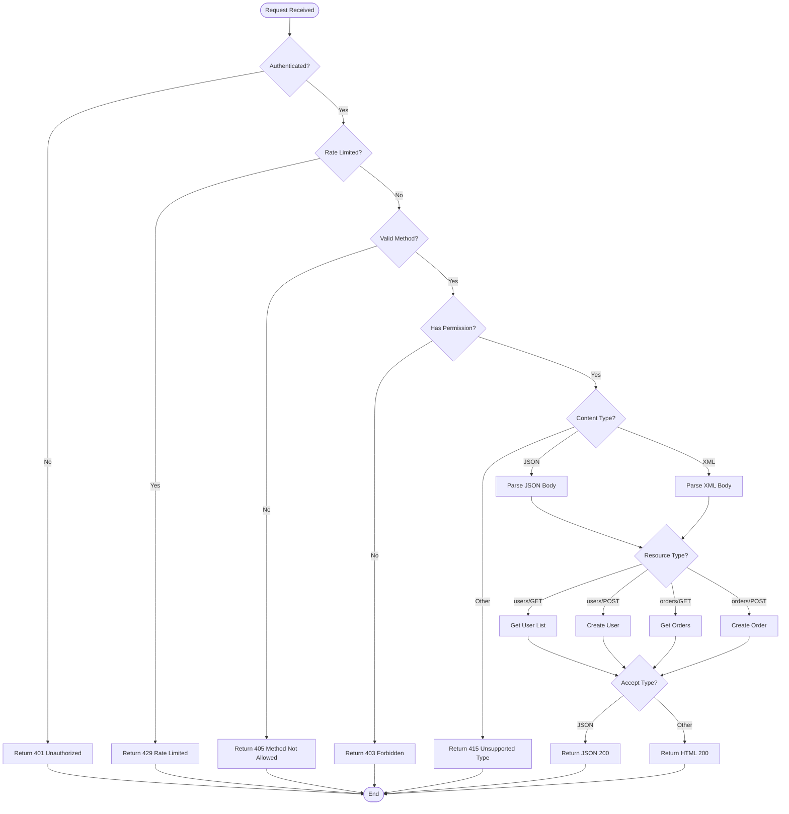

# Complexity Visualization Sample

## Code Snippet: Request Handler with Branching Logic

```python
def process_request(request):
    """
    Process incoming request with multiple decision branches.
    This example demonstrates 5+ decision points requiring visualization.
    """
    
    # Decision 1: Authentication check
    if not request.authenticated:
        return {"error": "unauthorized"}, 401
    
    # Decision 2: Rate limiting
    if request.ip in rate_limited_ips:
        return {"error": "rate limited"}, 429
    
    # Decision 3: Request method validation
    if request.method not in ["GET", "POST", "PUT", "DELETE"]:
        return {"error": "method not allowed"}, 405
    
    # Decision 4: Resource access control
    if not has_permission(request.user, request.resource):
        return {"error": "forbidden"}, 403
    
    # Decision 5: Data transformation based on content type
    if request.content_type == "application/json":
        data = parse_json(request.body)
    elif request.content_type == "application/xml":
        data = parse_xml(request.body)
    else:
        return {"error": "unsupported media type"}, 415
    
    # Decision 6: Business logic branching
    if request.resource == "users":
        if request.method == "GET":
            result = get_user_list(data)
        elif request.method == "POST":
            result = create_user(data)
    elif request.resource == "orders":
        if request.method == "GET":
            result = get_orders(data, request.params)
        elif request.method == "POST":
            result = create_order(data)
    
    # Decision 7: Response formatting
    if request.accept == "application/json":
        return jsonify(result), 200
    else:
        return render_html(result), 200
```

## Mermaid Flowchart Visualization



## Analysis Notes

### Decision Points Identified: 7 total

| # | Decision | Location | Branches | Impact |
|---|----------|----------|----------|--------|
| 1 | Authentication | Line 8-9 | 2 branches | Security gate - critical path |
| 2 | Rate Limiting | Line 12-13 | 2 branches | DoS protection - early exit |
| 3 | Method Validation | Line 16-17 | 2 branches | HTTP contract enforcement |
| 4 | Permission Check | Line 20-21 | 2 branches | Authorization boundary |
| 5 | Content Type Parse | Line 24-29 | 3 branches | Data format handling |
| 6 | Resource/Method Matrix | Line 32-37 | 4 branches | Business logic routing |
| 7 | Response Format | Line 40-43 | 2 branches | Client preference handling |

### Why Visualization Helps Here

1. **Error Path Clarity**: All 5 error paths (401, 429, 405, 403, 415) are visible at a glance
2. **Critical Path Identification**: The happy path flows through all 7 decisions to reach response formatting
3. **Coupling Points**: Permission check and content type parsing show where external dependencies matter
4. **State Machine**: Request progresses through validation → parsing → business logic → response stages

### Complexity Metrics

- **Cyclomatic Complexity**: 8 (1 + number of decision points)
- **Decision Density**: High - 7 decisions in ~50 lines
- **Branch Coverage Needed**: All 5 error paths must be tested separately from happy path
- **Refactoring Opportunity**: Resource/method matrix could be extracted to separate handler functions

### Documentation Value

Without this diagram:
- ❌ Developer would need to trace through code manually
- ❌ Error handling patterns not immediately visible
- ❌ Business logic branching hard to understand at a glance

With this diagram:
- ✅ All execution paths visible in one view
- ✅ Error handling strategy clear (fail-fast pattern)
- ✅ Business logic separation evident
- ✅ Quick impact analysis for changes

---

## How I Use This Pattern

When you ask me to analyze code, I will:

1. **Read every line** - No shortcuts on simple-looking files
2. **Count decision points** - If 3+, generate Mermaid diagram
3. **Trace all paths** - Including error and exception flows
4. **Document the why** - Explain architectural decisions behind branches
5. **Create actionable docs** - Not just pretty pictures, but developer guides

**Ready to analyze your codebase?** Just tell me what you'd like me to investigate! 🏺
